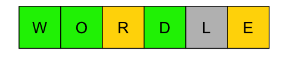
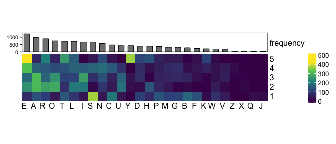
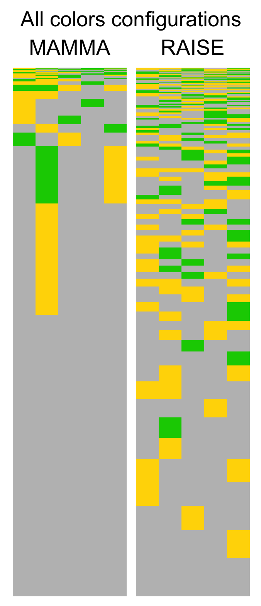

# Solving wordle

For a more in-depth explanation, please refer to the post I wrote regarding this project, available [here](https://frapria.github.io/blog/wordle_entropy)

[Wordle](https://www.nytimes.com/games/wordle/index.html) is an online game designed by Josh Wardle (no pun intended). The goal is to guess a 5 letters word, given 3 types of clues derived by the game: right letter in the right place (green), right letter but in the wrong place (yellow) and the letter is not in the target word (grey).
There are 2315 possible target word that you can find in [this list](https://docs.google.com/spreadsheets/d/1-M0RIVVZqbeh0mZacdAsJyBrLuEmhKUhNaVAI-7pr2Y/edit#gid=0).

The image below shows the frequencies distributions of each letter

In this project I try to find the optimal strategy for solving Wordle using Shannon's entropy concept. 
This method shows that the best first guess is the word RAISE and the worst is MAMMA.

