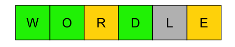
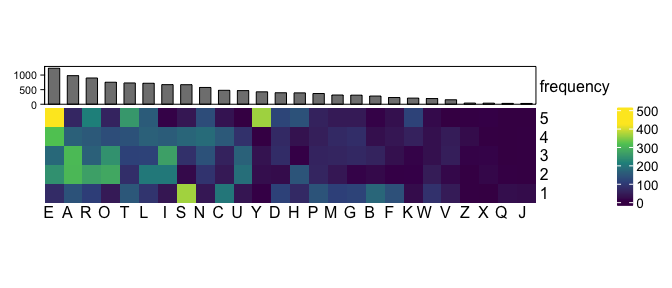
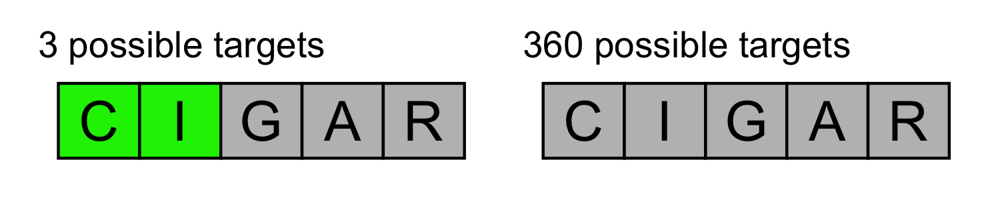
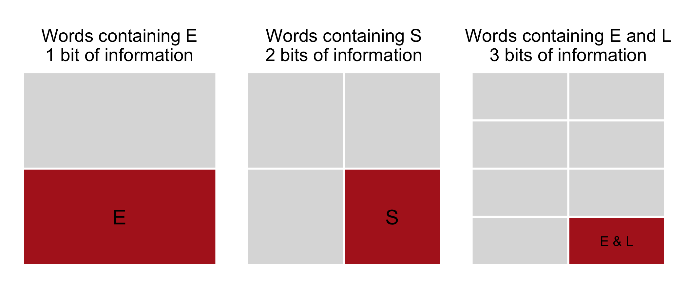
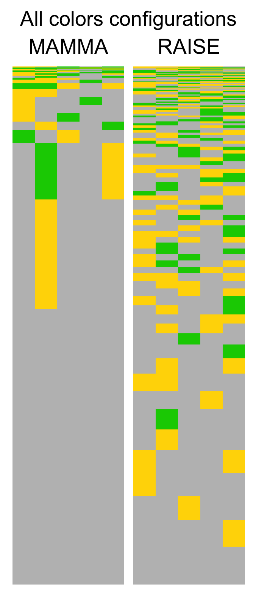
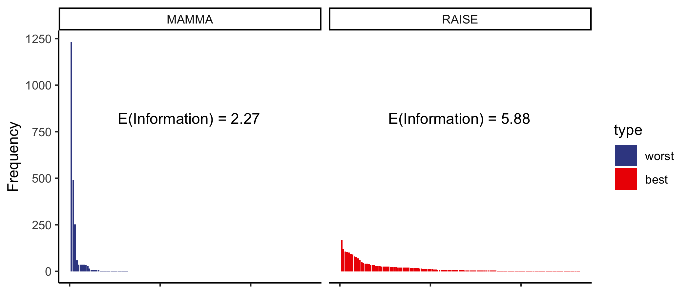
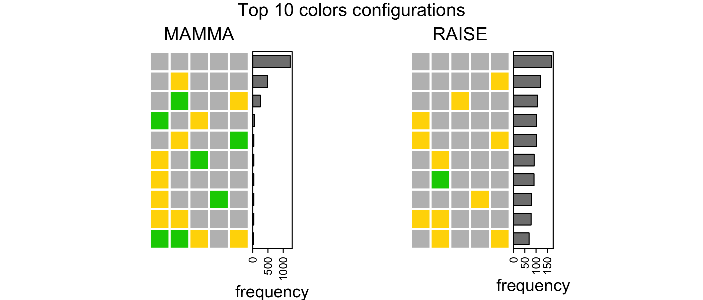
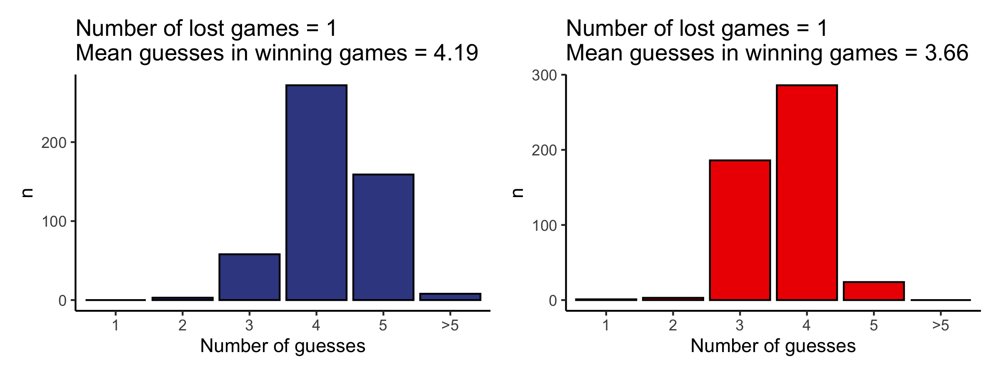

Wordle
================

# Starting data

Wordle is an online game designed by Josh Wardle (no jokes). The goal is
to guess a 5 letters word, given 3 types of clues derived by the game:

- right letter in the right place (green).
- right letter but in the wrong place (yellow).
- the letter is not in the target word (grey).

For semplicity (and for limited computational resources) I will use only
the 2315 [target
words](https://docs.google.com/spreadsheets/d/1-M0RIVVZqbeh0mZacdAsJyBrLuEmhKUhNaVAI-7pr2Y/edit#gid=0)
and not all the possible 5 letters words in the english dictionary. The
heatmap shows the frequency of each letter in each of the 5 positions.

# Strategy intuition

When we try to guess the target word we have $3^5$, so 243, possible
colors configuration, which is less that the dimension of the dictionary
(2315). This means that given a guess, some color configurations will be
repeated for different target words.  
Let’s take for example the word CIGAR: it will have, for example:

- only 1 green-green-green-green-green configuration (when the target is
  CIGAR itself).
- 3 green-green-grey-grey-grey with CIVIC, CINCH and CIVIL.
- it also has 360 (!) configurations with grey-grey-grey-grey-grey
  (*E.g.* hello / flush / lemon …).  

Therefore if I start with the word CIGAR and get
green-green-grey-grey-grey, that would be super **surprising** (or
informative) because I would be left with only 3 other words. But
getting an green-green-grey-grey-grey as response is also highly
**unlikely**, because it happens only with 3 words out of 2315
$\frac{3}{2315} = 0.001$.  

**GOAL:** I need to find a word that on average will give me highly
surprising (or informative) color configurations

*I.e* I look for a word that maximises the reduction of the space of
possibilities, I want to shrink that 2315 target words dictionary into a
smaller set. Sejal Dua in [her
arcticle](https://towardsdatascience.com/a-deep-dive-into-wordle-the-new-pandemic-puzzle-craze-9732d97bf723)
explains it well:  

> *We want to pick the word that yields the **largest remaining
> uncertainty** (or information). This means that, regardless of if we
> get a bunch of green and yellow tiles or all grey tiles, we will
> ensure that **all possible outcomes are similar** and that none of
> them are too bad.*

 

<!-- The optimal situation would be to find a word which has a unique combination of colors for every target word.  \ -->
<!-- But this is not possible, since we have many less color configurations that possible target words. So the idea is to approach the ideal optimal situation. I need to find a word for which the number of colors combination is minimum across the targets.  \ -->

 

Here is when entropy (or information) definition becomes handy:
Information theory entropy is a measure of “surprise” or “uncertanty”
relatively to all the possible outcome of a random variable. Here I use
“Information” and “Entropy” interchangeably.  

# Entropy

*No one really knows what entropy really is*
<footer>
— Von Neumann
</footer>

 

The unity measure of information is the bit. 1 Bit of information is an
observation that cuts the world of possibilities in half. Or in other
words, that it has $p = 0.5$ chance of occurrence. The formula for
information of an event with probability $p$ is $$
I = -log_2(p)
$$

which is equal to 1 when $p = 0.5$. Information is just a function of
the probability of a random variable, but it is useful when we need to
talk about space of possibilities, which in this case is the dictionary.
In particular Information has an opposite trend with respect to
probability, when an event is unlikely it has a small probability, but
high information.

*The basic intuition behind information theory is that learning that an
unlikely event has occurred is more informative than learning that a
likely event has occurred.*
<footer>
— Deep Learning - Ian Goodfellow
</footer>

 

Therefore, unlikely events are also highly informative. For example,
words containing the letter **E** are 1056 out of the 2315, so they
account for 45% of the dictionary. So it’s really common to find a word
with an E inside, and it would give about 1 ($-log2(0.45) = 1.15$) bit
of information (not so much then), since it cuts in half the space of
possibilities.  
Words containing the letter **S** are 550, so in this case this
requirement halves the space of possibilities twice (550 / 2315 = 0.24),
*i.e.* it splits it in 4 parts.
<!-- Words containing both the letters __E__ and __L__ are 280, so in this case this requirement halves the space of possibilities 3 times (280 / 2315 = 0.12), _i.e._ it splits it in 8 parts. -->

For each guess we make, we can measure how informative each color
configuration is and take the expected value of this information, which
is the information of each color configuration multiplied by its
probability of occuring $p_i$.

$$
I[guess] = \sum_{i}-p_i \cdot log_2(p_i)
$$ $$
i \in \{ \text{color configurations (total of 243)\}}
$$

The resulting value represents the average reduction of the dictionary
after choosing the *“guess”* word. Mathematically it is the expected
value of information that the *“guess”* word gives. It is an average
across all the possible 2315 targets.

Basically, we loop for each pair of guess and target words, we find the
5 colors associated to it. Then we compute the probability of having a
particular color combination, and plug it into the formula.

<!-- https://github.com/kbroman/testhtmlpage -->

# Best and worst starting words

This heatmap shows the frequency of colors distributions for the word
with highest expected value of information (the best word, RAISE), and
for the word with the lowest (the worst, MAMMA).  
The height of the heatmap represents the frequency that each color
configuration has, from the most common one at the bottom, to the rarest
at the top.

Here you see a clear visualization of the information of the starting
word.

> The word MAMMA about half of the time would give all greys, which
> would only split the dictionary in half, not much of a gain. **Just in
> the case that the target word is among the ones at the top of the
> matrix MAMMA would give an high information gain**, but to have that
> restricted set of words as targets is really **unlikely**.

The term MAMMA is a low entropy, or low information, opening word.

> While RAISE has a more homogeneous pattern of color configurations:
> **whatever the target word is, we are ensured to have an overall good
> shrink in the dictionary**.

RAISE is a high entropy, or high information, opening word.

We can visualize it in a different manner by plotting on x the all
possible color configurations and on y their frequencies, or
probabilities. Looking at the shape of the two distribution you can see
that **information is maximized when the probability distribution tends
to uniform**, in other words when the probabilities of color
configurations spread out.  
Even if MAMMA is probably the first word we said in real life, it is the
worst word to start with in WORDLE. This is because MAMMA has many
repeated letters that won’t give any information gain.  

RAISE has an information expected value of 5.88, this means that *on
average* this guess will halve the dictionary almost 6 times, so the
average dictionary size reduction will be from 2315 to
$$\frac{2315}{2^{5.88}} \sim 39$$ For MAMMA the reduction would be from
2315 to: $$\frac{2315}{2^{2.27}} \sim 480$$

# Performance

I run a simulation with 500 random target words from the list of 2315
words and using the most and the less informative word RAISE and MAMMA
as first guesses.

# Conclusions

Entropy is a mess. It is always tricky to understand and to explain
concepts related to probability distributions. The main message here is
that a system that has few possible configurations with heterogeneous
probabilites has a low entropy (and low information). In the wordle case
this system would be the game starting with the word MAMMA. while the
system with many configuration with almost equal probability of
occurring is a high entropy (or high information) system. This is the
case of the wordle game starting with RAISE.

<!-- Having an high entropy expected value for a system is synonym of being able to cut the space into almost equivalent parts -->

Note 1: the worst and best words in this article are different from the
Andrew Steele’s [video](https://www.youtube.com/watch?v=YEoCBnQwdzM)
because I used only input words that are also target words, while he
used all the 5 letter words in the english dictionary. This can change
the probability distributions and consequently the starting words. His
best word is SOARE, which is not among the target words list.

“If you guessed a coin flip correctly, how surprised would you be?  
A bit.”

 

Explaination: a fair coin has 2 faces with equal outcome probabilities
(0.5). The probability of having a head is 0.5, so you would be
$-log_2( 0.5 ) = 1$ bit surprised of getting it. In other words, each of
the two outcomes split the world of possibilities in half, from 2
possibilities to 1 possibility.  

# References

- This analysis is strongly inspired by 3Blue1Brown
  [video](https://www.youtube.com/watch?v=v68zYyaEmEA), corrected in
  this [new video](https://www.youtube.com/watch?v=fRed0Xmc2Wg)  
- Ask a mathematician, ask a physicist - What’s the relationship between
  entropy in the information-theory sense and the thermodynamics sense?
  [arcticle](https://www.askamathematician.com/2010/01/q-whats-the-relationship-between-entropy-in-the-information-theory-sense-and-the-thermodynamics-sense/)  
- Claude Shannon - “A Mathematical Theory of Communication”
  [paper](https://people.math.harvard.edu/~ctm/home/text/others/shannon/entropy/entropy.pdf)
- Sejal Dua’s “A Deep Dive into Wordle, the New Pandemic Puzzle Craze”
  [arcticle](https://towardsdatascience.com/a-deep-dive-into-wordle-the-new-pandemic-puzzle-craze-9732d97bf723)
- Another related video: Andrew Steele’s
  [video](https://www.youtube.com/watch?v=YEoCBnQwdzM)
